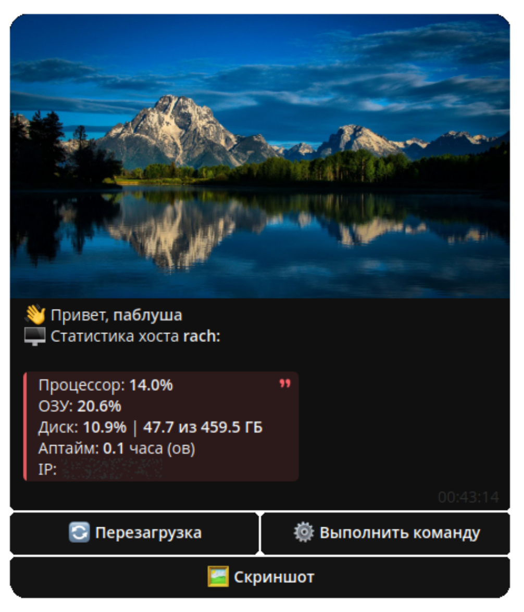

# 🖥 LinuxBridge

> Телеграм бот, использующий библиотеку [aiogram](https://github.com/aiogram/aiogram), который позволяет удаленно управлять вашей Linux системой



# ✨ Фичи
## ⤵️ Добавлено
- 🔄 **Перезагрузка**
- 🖼️ **Скриншот**
- ❔ **О боте**

## ⏳ В процессе
- ⚙️ Выполнение команд

## 🔮 Планируется
- 💾 Скачивание и загрузка файлов *(как из ТГ, так и по ссылке)*
- ✉️ Отправка уведомлений
- 📝 Полная информация о системе

# ⚙️ Установкка

- Качаем репозиторий:

    ```bash
    git clone https://github.com/pablushaa/LinuxBridge
    ```

- Устанавливаем зависимости:

    ```bash
    pip install -r requirements.txt
    ```

- В `config.py` указываем токен бота и список айди людей, у которых есть доступ к боту

- ✅ Запускаем через `main.py`

> В боте используется бинарник утилиты [maim](https://github.com/naelstrof/maim)
